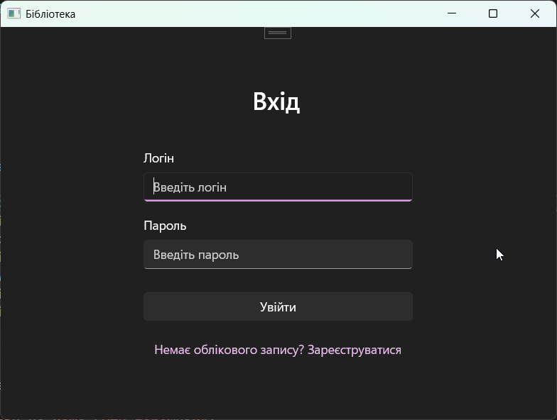
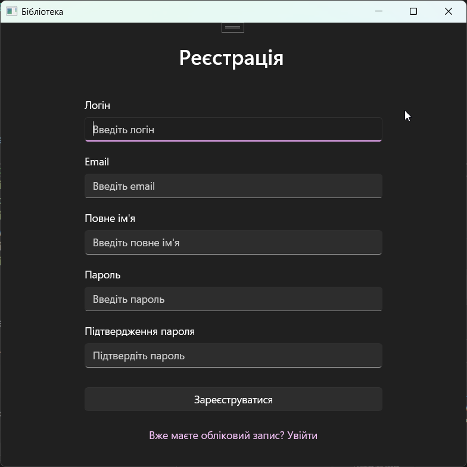
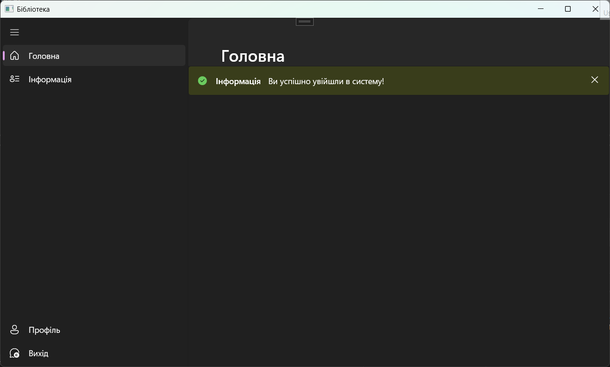
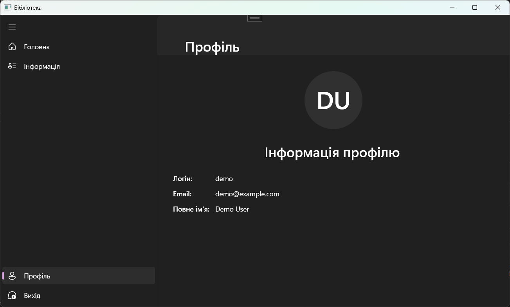

# Зразок додатку для входу та реєстрації користувачів

Цей проект є демонстраційним додатком для Windows, який показує реалізацію базової системи автентифікації користувачів з функціями входу та реєстрації. Додаток розроблено з використанням технології WinUI 3 та мови програмування C#.

## Технічні вимоги

- Windows 10 версії 10.0.17763.0 або новіше
- .NET 8.0
- Windows App SDK 1.7

## Функціональність

Додаток надає наступні можливості:

- **Реєстрація нових користувачів** з валідацією введених даних
- **Вхід існуючих користувачів** з перевіркою облікових даних
- **Перегляд профілю** користувача
- **Навігація** між різними сторінками додатку
- **Вихід** з облікового запису

## Структура проекту

Проект має наступну структуру:

- **Models** - містить класи моделей даних (User)
- **Pages** - містить сторінки додатку:
  - LoginPage - сторінка входу
  - RegisterPage - сторінка реєстрації
  - MainPage - головна сторінка з навігацією
  - HomePage - домашня сторінка
  - ProfilePage - сторінка профілю користувача
  - InfoPage - інформаційна сторінка
  - SettingsPage - сторінка налаштувань
- **Services** - містить сервіси:
  - AuthService - сервіс автентифікації

## Інструкція з встановлення та запуску

1. Клонуйте репозиторій на свій комп'ютер
2. Відкрийте файл рішення `SignInSignUpSample.sln` у Visual Studio 2022
3. Переконайтеся, що у вас встановлено .NET 8.0 та Windows App SDK 1.7
4. Виберіть конфігурацію (Debug/Release) та платформу (x86/x64/ARM64)
5. Натисніть F5 або кнопку "Запустити" для запуску додатку

## Опис інтерфейсу

### Сторінка входу

Сторінка входу містить:
- Поле для введення логіну
- Поле для введення пароля
- Кнопку "Увійти"
- Посилання на сторінку реєстрації

При введенні неправильних даних або залишенні полів порожніми, користувач отримує відповідні повідомлення про помилки.

### Сторінка реєстрації

Сторінка реєстрації містить:
- Поле для введення логіну (мінімум 3 символи)
- Поле для введення електронної пошти (з валідацією формату)
- Поле для введення повного імені
- Поле для введення пароля (мінімум 6 символів)
- Поле для підтвердження пароля
- Кнопку "Зареєструватися"
- Посилання на сторінку входу

Всі поля проходять валідацію, і користувач отримує повідомлення про помилки у разі некоректного введення.

### Головна сторінка

Після успішного входу користувач потрапляє на головну сторінку, яка містить:
- Бокову панель навігації з пунктами:
  - Головна
  - Інформація
  - Профіль
  - Вихід
- Основну область контенту, де відображається вибрана сторінка

### Сторінка профілю

Сторінка профілю відображає інформацію про поточного користувача:
- Аватар користувача (генерується автоматично на основі імені)
- Логін
- Електронна пошта
- Повне ім'я

## Демо-користувач

У додатку за замовчуванням створено демо-користувача з наступними обліковими даними:
- Логін: `demo`
- Пароль: `Password123$`
- Email: `demo@example.com`
- Повне ім'я: `Demo User`

## Плани на майбутнє

- Додати хешування паролів для підвищення безпеки
- Реалізувати збереження даних користувачів у базі даних або файлі
- Додати можливість редагування профілю
- Реалізувати темну та світлу теми інтерфейсу
- Додати можливість відновлення пароля
